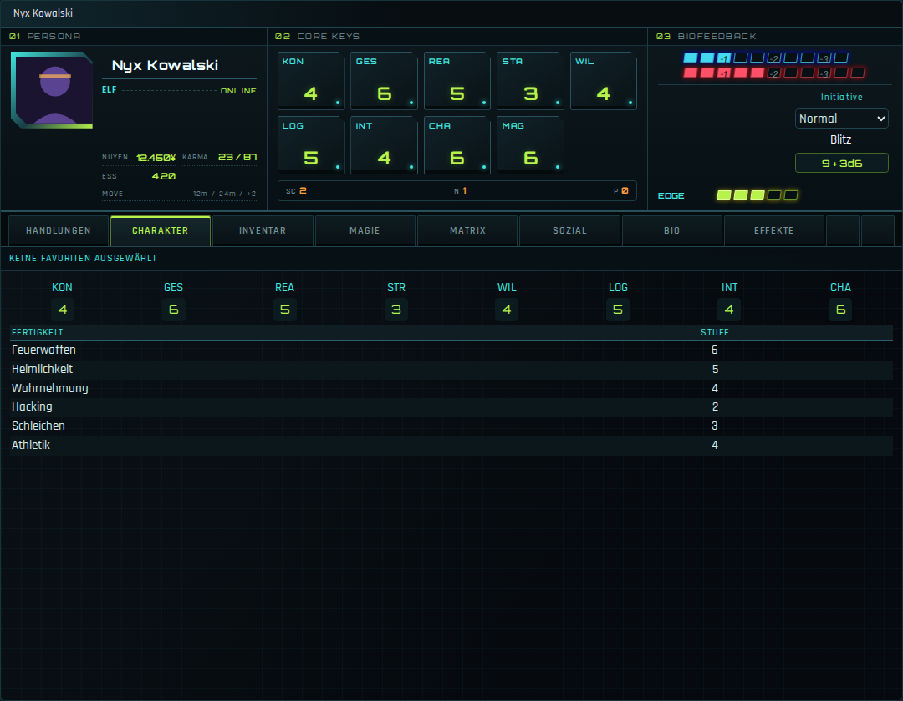

# SR5 Nova Sheet

Ein alternativer Charakterbogen für das [Shadowrun 5e System](https://github.com/SR5-FoundryVTT/SR5-FoundryVTT) in FoundryVTT – **volle Funktionalität des Systembogens in neuem Gewand**.

Design-Richtung: „Cyberdeck HUD“ – eine technische Deck-Konsole in Cyan und Signalgrün mit physischen Attribut-Keys, Biofeedback-Anzeigen und gerasterter Arbeitsfläche.



## Features

- **Cyberdeck-Kommandozeile:** Persona, Ressourcen, Bewegung, Attribut-Keys, Biofeedback, Initiative und Edge bilden eine breite Deck-Konsole über der Arbeitsfläche.
- **Physisches Attribut-Keybed:** Alle sichtbaren Attribute erscheinen als beleuchtete Hardware-Tasten – ein Klick würfelt die Attributsprobe.
- **Biofeedback-Monitor:** Geistig, Körperlich, Überlauf und Edge werden als kompakte Signalbalken neben der Initiative dargestellt.
- **Deck-Key-Navigation:** Die horizontalen Tabs wirken wie Funktionstasten eines Cyberdecks und lassen der Arbeitsfläche die volle Fensterbreite.
- **Konfigurationsmodus:** Stammdaten und Ressourcen werden direkt in der Persona-Konsole bearbeitet.
- **Volle System-Funktionalität:** Der Bogen erbt direkt vom System-Charakterbogen – alle Würfe, Item-Aktionen, Edit-/Spiel-Modus, Drag & Drop, Favoriten und Manager (Karma/Nuyen/Reputation) funktionieren unverändert. System-Updates an den Tab-Inhalten kommen automatisch mit.
- **Gebündelte Schriften:** Orbitron (Zahlen/Name) und Rajdhani (UI) liegen im Modul – kein Internetzugriff nötig.
- Deutsch und Englisch.

## Installation

In Foundry unter **Add-on-Module → Modul installieren** folgende Manifest-URL eintragen:

```
https://raw.githubusercontent.com/TimRoesler/sr5-nova-sheet/main/module.json
```

## Aktivierung

1. Modul in der Welt aktivieren.
2. Einen Charakterbogen öffnen → **Bogen-Konfiguration** (Zahnrad/„Sheet“ im Fenster-Header) → als Bogen **„SR5 Nova Sheet“** wählen.
3. Optional dort als Standard für alle Charaktere setzen.

Der Bogen ist nur für Akteure vom Typ *Charakter* registriert; alle anderen Typen nutzen weiterhin die Systembögen.

## Kompatibilität

- Foundry VTT v13/v14
- shadowrun5e ab v0.36.0

Da der Bogen die Templates der System-Tabs wiederverwendet, ist er robust gegenüber System-Updates. Sollte ein größeres System-Update den Charakterbogen umbauen, genügt in der Regel ein kleines Update dieses Moduls.

## English

An alternative character sheet for the Shadowrun 5e system – full system functionality in a dedicated cyberdeck HUD. A wide command console combines persona data, illuminated attribute keys, biofeedback tracks and initiative above a full-width work area with hardware-style navigation keys. Install via the manifest URL above, then select **SR5 Nova Sheet** in the sheet configuration of a character actor.

## Lizenz

MIT – siehe [LICENSE](LICENSE). Gebündelte Schriften Orbitron und Rajdhani stehen unter der SIL Open Font License 1.1.
